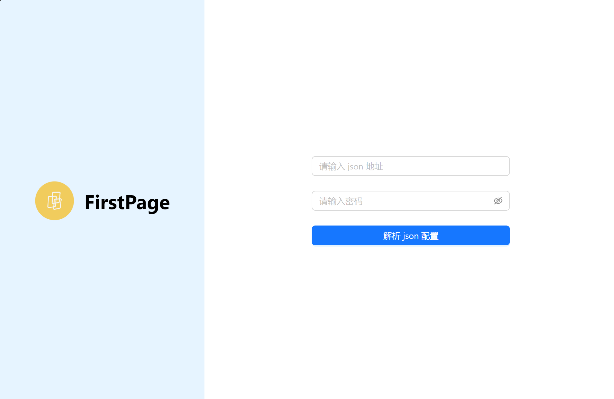
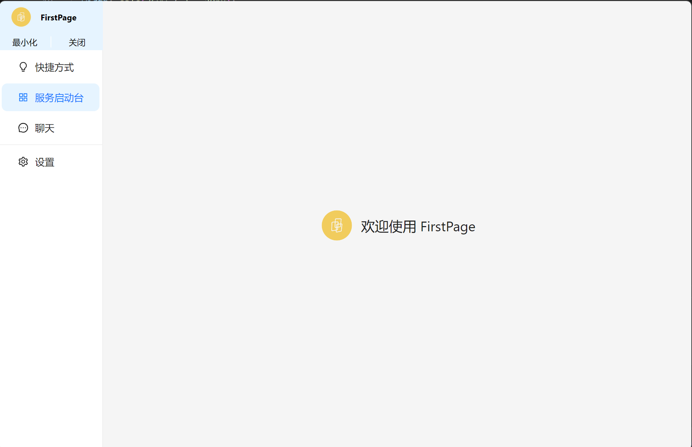
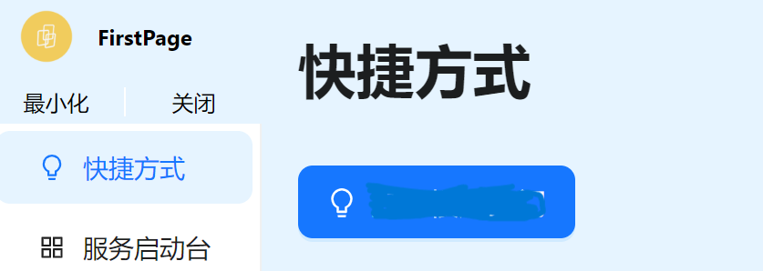
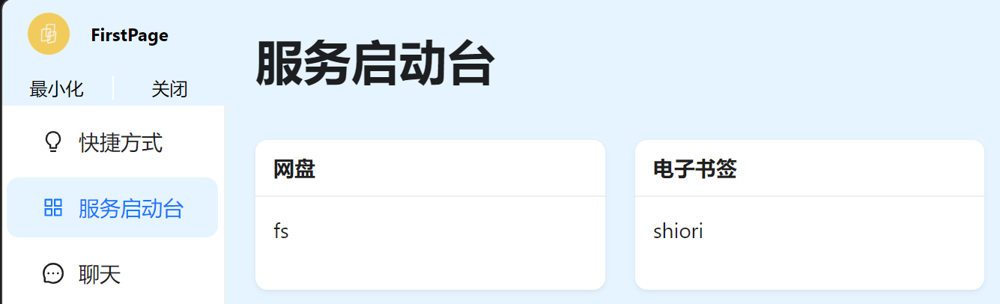
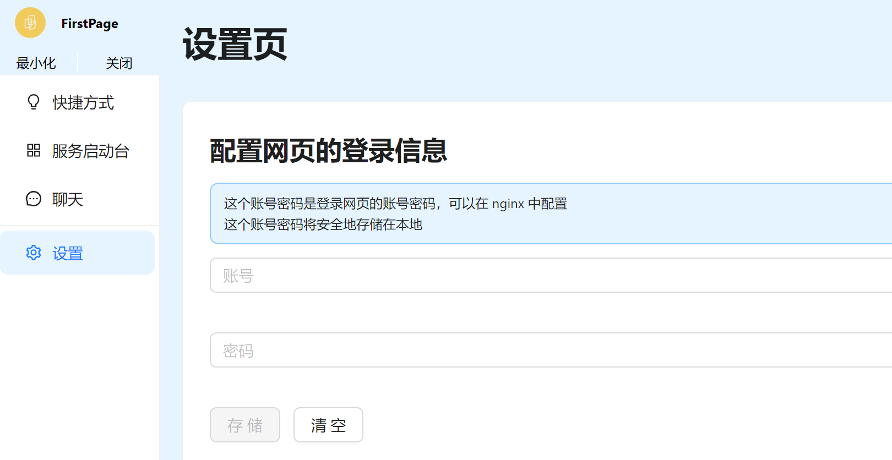

# 电脑桌面端

目前的桌面端很简单，很容易上手，下面让我们来详细了解下如何使用电脑桌面端

## 根据预设好的 SCHEMA 配置服务 JSON

与[手机客户端](./mobile#根据预设好的-schema-配置服务-json)相同

## 加密 JSON 文件并生成可访问的链接

与[手机客户端](./mobile#加密-json-文件并生成可访问的链接)相同

## 下载客户端

目前还在内测阶段

- mac 或 windows 用户都可以直接联系我，获取对应安装包

## 在首页输入 JSON 链接

打开应用可以看到要求输入 json 配置链接，输入后即可将配置导入进客户端中**本地存储**

## 欢迎页

## 快捷方式页

点击快捷按钮会发送一次之前 json 配置好的请求，**点击后 5s 才能下一次点击**

可以用于打开门禁，打开电灯，触发事件等等场景

## 服务启动台

服务列表中都是之前 json 配置中的服务

点击列表中的服务会跳到一个 webview 页面，可以在客户端中方便快捷的访问自己的 web 服务

## 配置页

目前配置页比较简单，只有两个配置

### 配置网页的登录信息

有些网页为了安全可能配置了 **nginx 登录信息**

为了便捷的访问到这些 web 服务，可以在这里先设置好账号与密码，**账号与密码将安全地存在本地**

设置好后点击服务列表中的服务，我会自动将登录信息带到 url 头部再转到 webview

### 重新配置 json

点击这个按钮将把原来存在本地的 json 文件删除并跳回到首页
