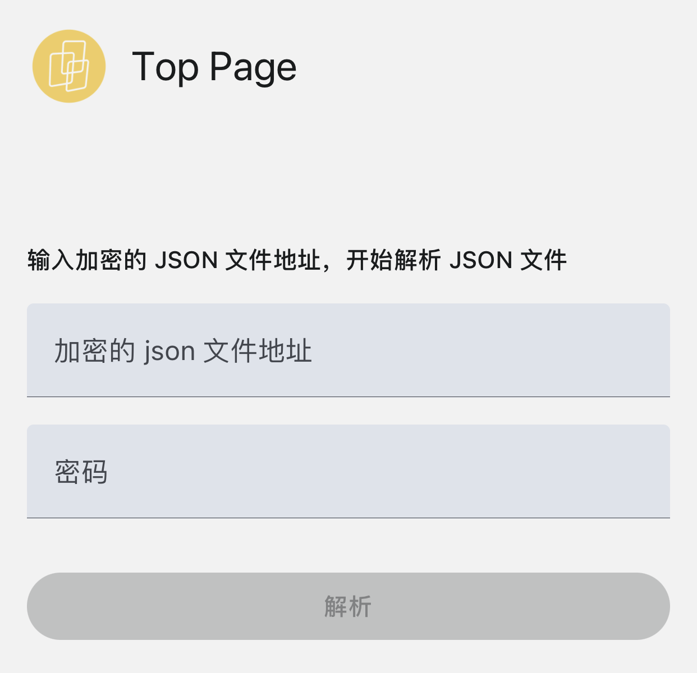
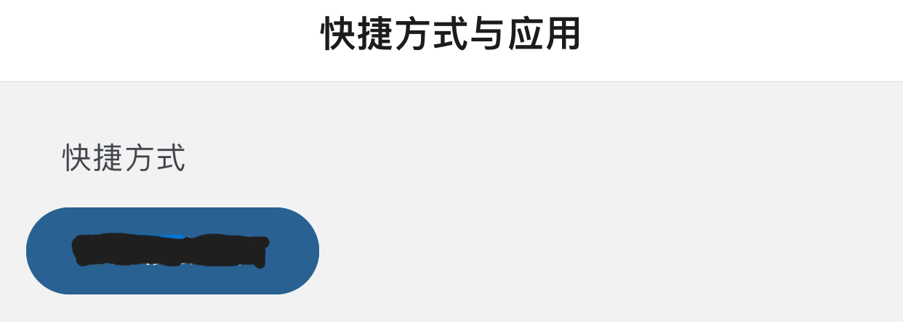
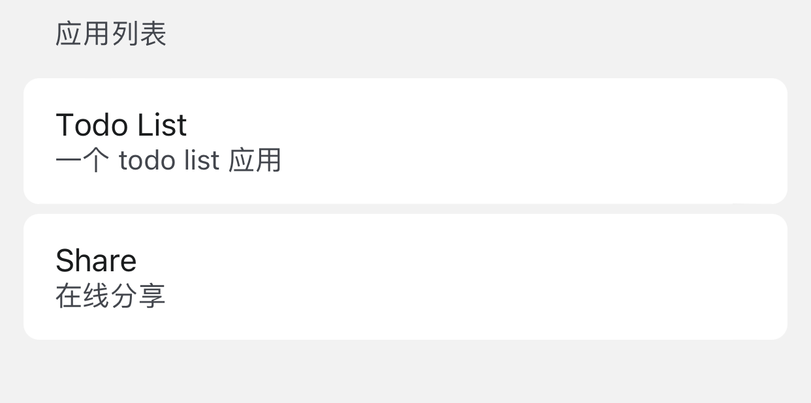
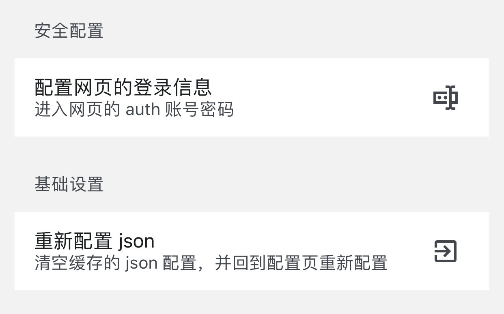
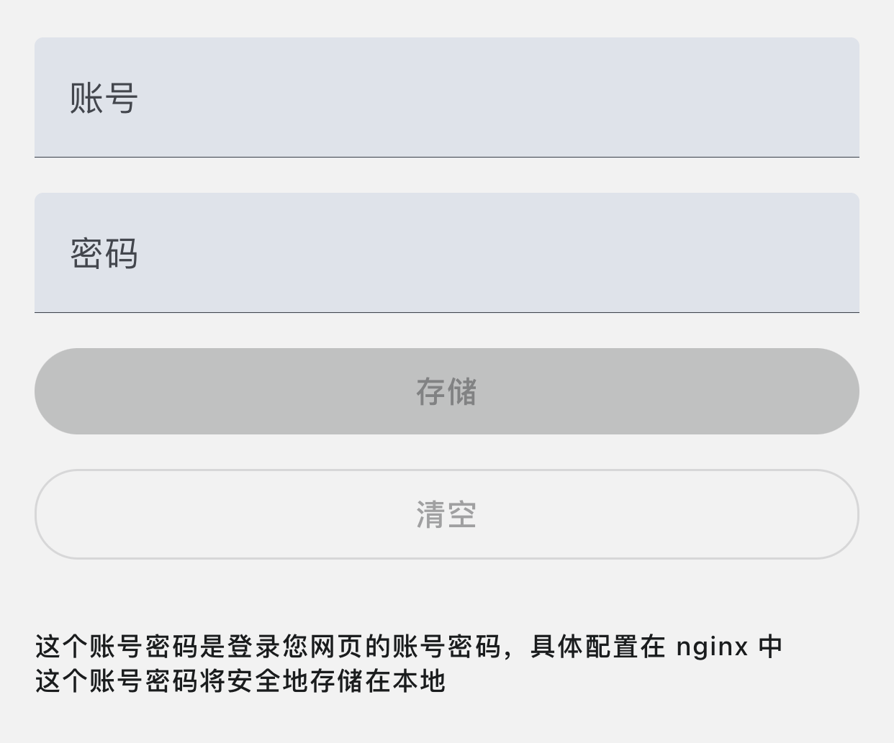

# 手机客户端

目前的手机客户端很简单，很容易上手，下面让我们来详细了解下如何使用手机客户端

## 根据预设好的 SCHEMA 配置服务 JSON

### JSON type

| key      | type         | explaination | 是否必填 |
| -------- | ------------ | ------------ | -------- |
| SHORTCUT | ShortCutType | 快捷方式     | 否       |
| URL      | URLType      | 服务         | 否       |

### ShortCutType type

| key    | type                          | explaination         | 是否必填 |
| ------ | ----------------------------- | -------------------- | -------- |
| title  | string                        | 展示的名字           | 是       |
| action | uri: string, headers?: object | 点击按钮后触发的 url | 是       |

### URLType type

| key       | type   | explaination      | 是否必填 |
| --------- | ------ | ----------------- | -------- |
| title     | string | 服务的名字        | 是       |
| desc      | string | 服务的描述        | 是       |
| uri       | string | 服务的链接        | 是       |
| encrypted | 0 / 1  | 是否有 gninx 加密 | 否       |

```ts
interface ShortCutType {
  title: string;
  action: {
    uri: string;
    headers?: Record<string, string>;
  };
}
interface URLType {
  title: string;
  desc: string;
  uri: string;
  encrypted?: 0 | 1;
}
type ConfigJsonType = {
  SHORTCUT: ShortCutType[];
  URL: URLType[];
};
```

eg.

```ts
const config = {
  SHORTCUT: [
    {
      title: "打开所有灯",
      action: {
        uri: "https://myservice.com/openAllLight",
        headers: {
          auth: "your-authkey",
        },
      },
    },
  ],
  URL: [
    {
      title: "我自己的 todo list",
      desc: "我自己的 todo list",
      uri: "https://mytodolist.com",
    },
    {
      title: "智能家居平台",
      desc: "home assistant",
      uri: "https://myhomeassistant.com",
    },
  ],
};
```

## 加密 JSON 文件并生成可访问的链接

上一步配置好的服务 JSON 为了安全性需要[加密](/encrypt)

拿到加密后的密文将他另存为一个文件，可以放到自己的 **OSS** 中，也可以放到自己**家中的服务器**中，只要能生成一个可访问到他的链接即可

## 下载 APP

目前还在内测阶段

- IOS 用户可以联系我，我会加到外部测试人员名单中
- 安卓用户可以联系我，直接获取 apk 安装包

## 在首页输入 JSON 链接

打开应用可以看到要求输入 json 配置链接，输入后即可将配置导入进 app 中**本地存储**


## 首页

首页分为快捷按钮区域与服务列表区域

### 快捷按钮

点击快捷按钮会发送一次之前 json 配置好的请求，**点击后 5s 才能下一次点击**

可以用于打开门禁，打开电灯，触发事件等等场景


### 服务列表

服务列表中都是之前 json 配置中的服务

点击列表中的服务会跳到新的页面，这个页面是一个 webview，可以在 app 中便捷的访问自己的 web 服务


## 配置页

目前配置页比较简单，只有两个配置


### 配置网页的登录信息

有些网页为了安全可能配置了 **nginx 登录信息**

为了便捷的访问到这些 web 服务，可以在这里先设置好账号与密码，**账号与密码将安全地存在本地**

设置好后点击服务列表中的服务，我会自动将登录信息带到 url 头部再转到 webview


### 重新配置 json

点击这个按钮将把原来存在本地的 json 文件删除并跳回到配置页面
